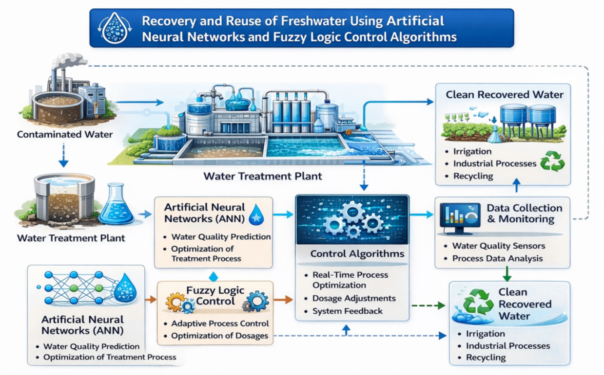
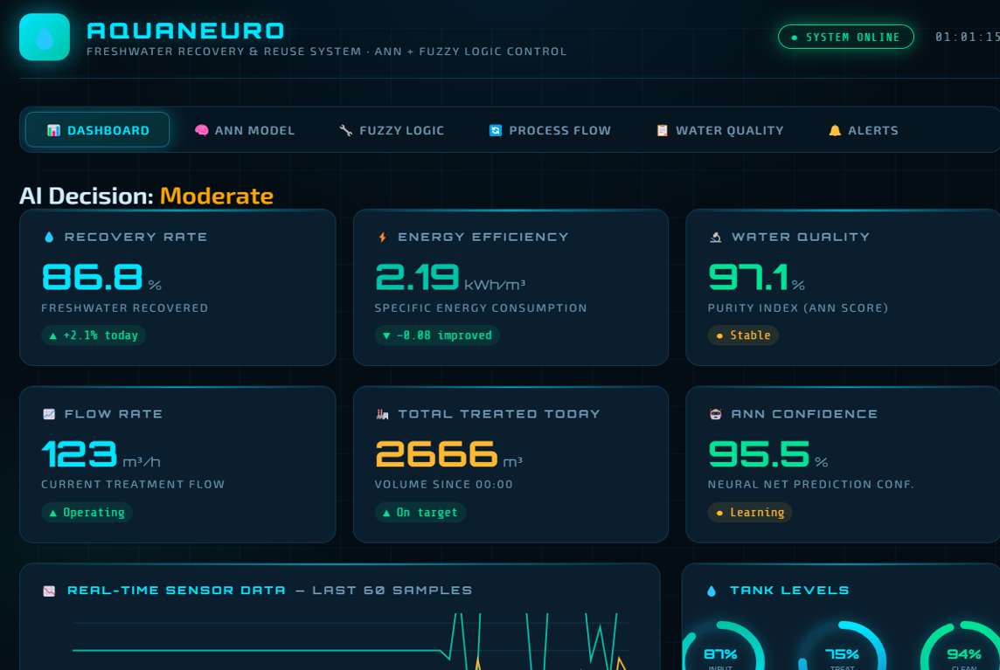
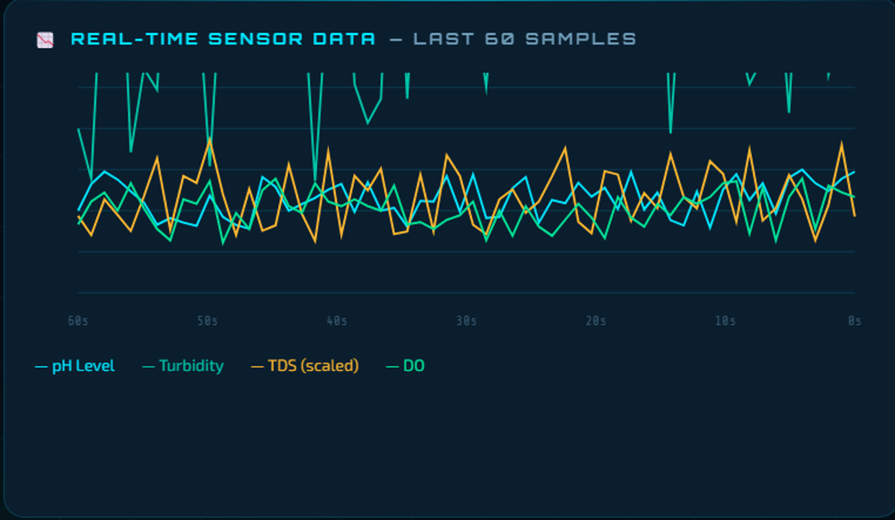
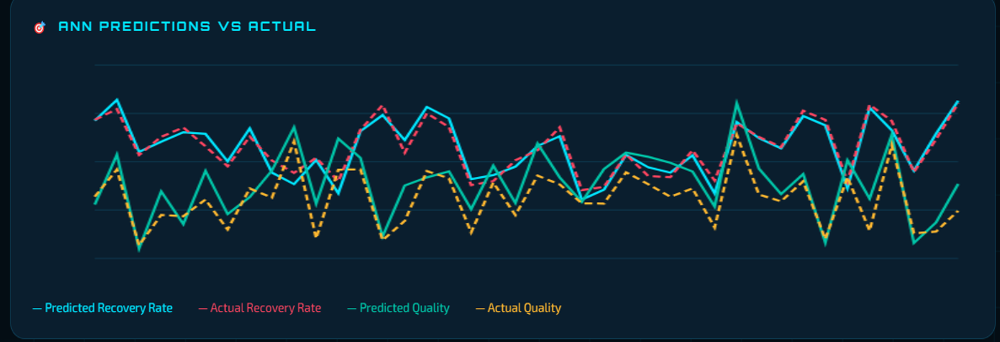

# AquaNeuro: Intelligent Water Recovery and Conservation System

## Overview

AquaNeuro is an AI-powered smart water management system designed to monitor, analyze, and optimize water usage. The project focuses on reducing water wastage, improving water recovery processes, and promoting sustainable water conservation practices through intelligent data analysis and automation.

## Problem Statement

Water scarcity is a growing global concern. Large amounts of water are wasted due to leaks, inefficient usage patterns, and poor monitoring systems. Traditional water management approaches often fail to provide real-time insights and predictive analysis for effective conservation.

## Objectives

* Monitor water consumption in real time.
* Detect abnormal water usage and potential leakages.
* Predict future water demand using AI models.
* Promote efficient water recovery and reuse.
* Reduce overall water wastage.
* Support sustainable water resource management.

## Features

* Real-time water usage monitoring.
* AI-based analytics and prediction.
* Water leakage detection.
* Smart alerts and notifications.
* Data visualization dashboard.
* Water recovery and conservation recommendations.

## Architecture Diagram





## Dashboard Screenshots

### Home Dashboard




### Real-Time Sensor Data Analysis



### ANN Prediction vs Actual Performance



## Technologies Used

* Python
* Machine Learning
* Computer Vision (if applicable)
* Flask / Django
* Firebase
* HTML, CSS, JavaScript
* Data Analytics Libraries (NumPy, Pandas, Matplotlib)

## System Architecture

1. Data Collection
2. Data Preprocessing
3. AI-Based Analysis
4. Water Usage Prediction
5. Leakage Detection
6. Smart Recommendations
7. Dashboard Visualization

## Dataset

The system utilizes water consumption and recovery-related datasets collected from publicly available sources and simulated sensor data for model training and testing.

## Methodology

1. Collect water usage data from sensors or datasets.
2. Clean and preprocess the collected data.
3. Train machine learning models to identify usage patterns.
4. Detect anomalies indicating possible water leaks.
5. Generate predictions for future consumption.
6. Provide actionable recommendations to reduce water wastage.

## Results

* Improved water monitoring efficiency.
* Early detection of water leakages.
* Reduced unnecessary water consumption.
* Enhanced decision-making through predictive analytics.

## Future Scope

* IoT sensor integration.
* Mobile application development.
* Smart city water management deployment.
* Advanced deep learning models for improved prediction accuracy.
* Integration with government water conservation initiatives.

## Installation

```bash
git clone https://github.com/your-username/AquaNeuro.git
cd AquaNeuro
pip install -r requirements.txt
python app.py
```

## Usage

Run the application and access the dashboard through your local server to monitor water usage, view predictions, and receive conservation recommendations.

## Contributors

* Premasai Chowdary
* Team Members

## License

This project is developed for educational and research purposes.

## Impact

AquaNeuro contributes to sustainable development by promoting responsible water consumption, reducing wastage, and improving water recovery mechanisms through Artificial Intelligence.
